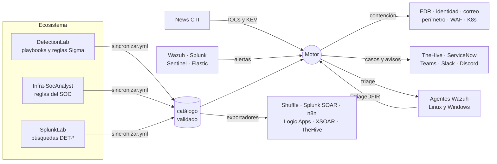

# 🛡️ ResponseLab — respuesta a incidentes como código, multi-SIEM y multi-SOAR


**Los playbooks de [DetectionLab](https://github.com/BlueShield-Ch4rl13/Detection-lab), ejecutados.**
DetectionLab dice qué hacer con cada alerta y por qué. ResponseLab convierte eso en
decisiones que una máquina puede tomar sin romper nada. Es un motor multi-cliente
(pensado para un MSSP) que recibe las alertas de cualquier SIEM, decide con la misma
lógica para todos y actúa con las herramientas de cada cliente. Si el cliente ya
tiene un SOAR, la misma lógica se exporta a ese SOAR.

Se alimenta solo del resto del ecosistema:
- las reglas y los playbooks de DetectionLab, Infra-SocAnalyst y SplunkLab;
- la inteligencia de News CTI;
- los informes de FtriageDFIR y de Malpipe.

Un workflow diario sincroniza, valida, prueba y publica. Los motores desplegados
recogen el catálogo nuevo solos, y solo si pasa su propia validación.



---

## 🎯 Las decisiones, y el porqué

**Una decisión, varios ejecutores.** La lógica vive en un único módulo,
[`responselab/nucleo.py`](responselab/nucleo.py): Python puro, sin dependencias y
determinista. Ese mismo código corre en el motor y va incrustado en el nodo de
Shuffle, en los playbooks de Splunk SOAR y en el script de Cortex XSOAR. Sentinel
recibe una traducción estática con las mismas comprobaciones en tiempo de ejecución.
Un cliente con XSOAR y otro con Wazuh y TheHive reciben la misma respuesta al mismo
ataque.

**Radio × reversibilidad, no "nivel de confianza".** Una acción se ejecuta sola
cuando su radio es estrecho (un proceso, un fichero, una sesión, un equipo) y se
puede deshacer. Hay tres reglas que ningún catálogo ni ningún perfil pueden saltarse:
- Nada de radio *cuenta* u *organización* se ejecuta sin una persona.
- Lo irreversible solo es automático sobre un proceso identificado sin ambigüedad.
- Un fichero del sistema operativo o un almacén de credenciales nunca se toca solo.

Están en el código, y el CI las comprueba simulando una alerta crítica de cada una de
las 235 reglas. [`docs/POLITICA.md`](docs/POLITICA.md) cuenta el modelo entero.

**Lo que no se sabe es "no se sabe".** Cada pregunta de triaje y cada excepción
contesta *sí*, *no* o *no lo sé*. «No lo sé» nunca se convierte en «sí» por
defecto: la acción se prepara y espera aprobación. Una excepción que no se puede
descartar por falta de inventario no es una excepción descartada.

**El caso lo hace la secuencia, no la alerta.** Siete secuencias de ataque correlan
alertas del mismo equipo o de la misma persona y elevan la respuesta cuando el
conjunto ya no admite otra lectura:
- ransomware;
- intrusión SSH;
- phishing que acaba en la cuenta;
- robo de credenciales y movimiento lateral;
- explotación web;
- sensor ciego con actividad;
- acceso y exfiltración.

Defensas desactivadas en un puesto es una alerta para analizar. Si a los cuatro
minutos se borran las copias sombra del mismo equipo, el equipo se aísla solo.

**Lo protegido no se toca solo.** Un controlador de dominio, un HMI de planta o un
servidor de producción declarados en el perfil del cliente no reciben ninguna
acción automática, tampoco la recogida de evidencia. Aislar un DC deja sin
autenticación a toda la organización; esa decisión la toma alguien que sabe qué hay
detrás.

**Simulación primero.** Cada cliente arranca en simulación: el motor decide,
registra y enseña las peticiones exactas que haría, sin tocar nada.
`RL_SIMULACION_GLOBAL=true` es el interruptor de emergencia que devuelve a todos a
simulación en el acto.

**Todo deja rastro y casi todo se deshace.**
- La auditoría es una cadena de hashes: un registro alterado se detecta.
- Cada acción reversible guarda lo necesario para su inversa.
- Las aprobaciones caducan.
- La misma acción no se repite dos veces en el mismo incidente aunque sigan
  llegando alertas del mismo ataque.

**Multi-cliente de verdad.** Hay un perfil YAML por cliente, sin secretos: solo
nombres de variables de entorno y huellas SHA-256 de los tokens. Hay tokens
distintos para ingerir alertas, para los agentes, para las listas EDL de los
cortafuegos y para cada aprobador. El token de un cliente nunca sirve para otro.

**El ecosistema se sincroniza solo, pero no a ciegas.** Copiar en vez de leer en
caliente hace que cada cambio aguas arriba llegue como un diff revisable. Si
DetectionLab cambia una acción de contención y deja de estar mapeada a algo
ejecutable, el CI se pone en rojo antes de que la vea un motor.

---

## 📊 Qué cubre

| | |
|---|---|
| **Reglas** | 235: 207 de DetectionLab (Sigma y Wazuh), 7 de Infra-SocAnalyst, 21 de SplunkLab |
| **Familias de playbook** | 16: AD, cloud, contenedores, correo, credenciales, cumplimiento, endpoint, exfiltración, inteligencia, Linux, macOS, red, web, XDR, Zero Trust y genérica |
| **Acciones ejecutables** | 54, cada una con radio, reversibilidad, capacidad e inversa |
| **SIEM de entrada** | Wazuh (integración y active response), Splunk (alerta webhook), Microsoft Sentinel (regla de automatización), Elastic Security (conector webhook) |
| **SOAR de salida** | Shuffle con TheHive y Cortex, Splunk SOAR, n8n, Sentinel Logic Apps, Cortex XSOAR y plantillas de caso de TheHive 5 |
| **Contención** | Wazuh (agentes Linux y Windows), Microsoft Defender for Endpoint, Entra ID, Exchange Online, CrowdStrike Falcon, SentinelOne, Palo Alto, FortiGate, Cloudflare, Kubernetes y listas EDL para cualquier cortafuegos |
| **Cualquier otra herramienta** | Conectores declarativos en YAML (Cisco ISE, OPNsense, ServiceNow y webhook genérico de ejemplo) y scripts para lo que no tiene API |
| **Avisos** | Teams, Slack, Discord, webhook y correo |
| **Plazos legales** | RGPD (72 h), NIS2 (24 h / 72 h / 1 mes) y DORA, desde que se abre el incidente |

La cobertura detallada por familia la genera el compilador en
[`docs/COBERTURA.md`](docs/COBERTURA.md): qué contesta la máquina, qué se ejecuta
solo en una alerta crítica y qué hace cada acción.

---

## 🧪 Diez ataques que el CI repite en cada cambio

Cada escenario es un ataque contado con alertas reales, en el formato nativo de su
SIEM, junto con lo que el motor tiene que hacer y, sobre todo, lo que no debe hacer
nunca. `tools/simular.py` los pasa por el motor de verdad, en simulación. Hoy dan
**10/10 y 176/176 comprobaciones**.

| Escenario | Lo que demuestra |
|---|---|
| Ransomware en un puesto de finanzas | La secuencia aísla el equipo **una vez**. `vssadmin.exe` no va a cuarentena. Corren RGPD y NIS2. |
| Intrusión SSH en la DMZ | Dos alertas sueltas no contienen; a la tercera, sí. El crontab va a custodia; `/etc/shadow`, no. |
| DCShadow contra el controlador de dominio | Nada automático sobre el DC, ni siquiera la recogida de evidencia. |
| Explotación web en producción | Escala a L3 y recoge evidencia; sin matar procesos ni bloquear en el WAF a ciegas. |
| Phishing que acaba en un MFA nuevo | El clic solo no revoca nada; el MFA nuevo de la misma persona revoca sus sesiones en Entra ID. |
| Acceso anónimo y reenvío del correo | Sentinel y Splunk a la vez. Se deshabilita la regla del buzón; avisa al DPD; RGPD, NIS2 y DORA. |
| Credenciales robadas y salto a la red OT | El puesto de ingeniería se aísla con CrowdStrike; el HMI protegido, no. |
| Sensor EDR parado y persistencia | Ceguera seguida de actividad: aviso a guardia. |
| Reglas fuera del catálogo | Una regla que nadie ha revisado no contiene sola, se declare como se declare. |
| Escáner autorizado | Baja la severidad en su ventana, pero no cierra la alerta: falta un dato que no viaja en ella. |

Detalle y formato: [`escenarios/LEEME.md`](escenarios/LEEME.md).

---

## 🚀 Uso

Requisitos: Python 3.10 o superior. En Windows, los mismos comandos funcionan en
PowerShell.

```powershell
git clone https://github.com/BlueShield-Ch4rl13/ResponseLab
cd ResponseLab
python -m pip install -r requirements-dev.txt

python tools/validar.py                            # catálogo, contratos e invariantes
python tools/simular.py --detalle ransomware-puesto  # un ataque, con el plan de cada alerta
python -m pytest -q                                # las 1183 pruebas
```

**Decidir una alerta sin ejecutar nada:**

```powershell
python -m responselab decidir --siem wazuh --cliente lab alerta.json
```

**El motor en local, en simulación:**

```powershell
$env:RL_SIMULACION_GLOBAL = "true"
$env:RL_LAB_TOKEN = "un-token-de-prueba"
python -m responselab servir --puerto 8080
# panel: http://localhost:8080/panel   ·   salud: http://localhost:8080/salud
```

**Con Docker, detrás de un proxy TLS:**

```bash
cp .env.example .env            # rellenar tokens: python -m responselab token
docker compose up -d --build    # https://localhost:8443
```

**Laboratorio de purple team.** Levanta el motor en simulación y le lanza los
escenarios de ataque del cliente `lab`:

```bash
docker compose -f docker-compose.yml -f docker-compose.lab.yml up -d --build
docker compose -f docker-compose.yml -f docker-compose.lab.yml run --rm escenarios
```

Desplegarlo para clientes reales, con TLS, tokens, copias de seguridad y el paso de
simulación a producción, está en [`docs/PRODUCCION.md`](docs/PRODUCCION.md). El
despliegue en el servidor propio del laboratorio, junto a Infra-SocAnalyst y
SplunkLab, está en [`docs/SERVIDOR.md`](docs/SERVIDOR.md).

---

## 🔌 Conectarlo a lo que ya tienes

| Herramienta | Cómo se conecta | Guía |
|---|---|---|
| **Wazuh** | Integración `custom-responselab` en el manager, active response en los agentes Linux y Windows, acuses de vuelta por el propio Wazuh | [`docs/SIEM.md`](docs/SIEM.md#wazuh) |
| **Splunk** | Acción de alerta webhook en las búsquedas de DetectionLab y de SplunkLab, con lista de URL permitidas | [`docs/SIEM.md`](docs/SIEM.md#splunk) |
| **Elastic Security** | Conector webhook con autenticación básica cifrada, añadido en bloque a las reglas | [`docs/SIEM.md`](docs/SIEM.md#elastic) |
| **Microsoft Sentinel** | Logic Apps nativas (Defender, Entra ID) o reenvío al motor, con regla de automatización | [`docs/SOAR.md`](docs/SOAR.md#microsoft-sentinel) |
| **Cortex XSOAR** | Script de decisión y un playbook por familia con los playbooks genéricos del marketplace | [`docs/SOAR.md`](docs/SOAR.md#cortex-xsoar) |
| **Splunk SOAR** | Playbook enrutador con el núcleo incrustado y uno por familia | [`docs/SOAR.md`](docs/SOAR.md#splunk-soar) |
| **Shuffle y TheHive** | Workflow que llama al motor, plantillas de caso por familia | [`docs/SOAR.md`](docs/SOAR.md#shuffle-y-thehive) |
| **n8n** | Workflow de entrada, decisión y aviso | [`docs/SOAR.md`](docs/SOAR.md#n8n) |
| **Cualquier API** | Un YAML en `conectores/` | [`conectores/LEEME.md`](conectores/LEEME.md) |

---

## 📂 Qué hay dentro

```
responselab/           el motor
  nucleo.py              la decisión: normalización, triaje, secuencias, política (sin dependencias)
  ejecutor.py            cola, correlación, ejecución, aprobaciones, deshacer, plazos legales
  api.py · panel.html    API HTTP y panel de aprobaciones
  conectores/            Wazuh, Microsoft, CrowdStrike, SentinelOne, Palo Alto, Fortinet, Cloudflare...
  exportadores/          generadores para cada SOAR y SIEM
playbooks/             capa ejecutable de cada familia: evaluadores, excepciones, secuencias
acciones/catalogo.yml  las 54 acciones con radio, reversibilidad, capacidad e inversa
clientes/              un perfil por cliente (lab, acme, norte y la plantilla)
catalogo/catalogo.json lo que carga el motor (generado)
soar/                  lo que se importa en cada SOAR (generado)
siem/                  integración de Wazuh, Splunk y Elastic; scripts de active response
ecosistema/            lo que se trae de los otros repositorios (sincronizado)
escenarios/            ataques de extremo a extremo
tools/                 sincronizar, compilar, validar, simular, importar en TheHive
tests/                 1183 pruebas
```

---

## 🔗 El ecosistema

| Proyecto | Qué aporta a ResponseLab |
|---|---|
| [Detection-lab](https://github.com/BlueShield-Ch4rl13/Detection-lab) | Los 15 playbooks de respuesta (qué hacer y por qué), las reglas Sigma y sus traducciones a Wazuh y Splunk |
| [Infra-SocAnalyst](https://github.com/BlueShield-Ch4rl13/Infra-SocAnalyst) | La plataforma del laboratorio (Wazuh, Falco, Tetragon, Suricata, Shuffle, TheHive) y sus reglas 110xxx |
| [SplunkLab](https://github.com/BlueShield-Ch4rl13/SplunkLab) | Las búsquedas DET-* del laboratorio de Splunk |
| [ScriptNewsCTI](https://github.com/BlueShield-Ch4rl13/ScriptNewsCTI) | IOCs priorizados por explotación activa y CVE del catálogo KEV, consultados en cada decisión |
| [FtriageDFIR](https://github.com/BlueShield-Ch4rl13/FtriageDFIR) | El triage forense que lanzan los agentes; su informe vuelve al incidente como evidencia |
| [Malpipe](https://github.com/BlueShield-Ch4rl13/Malpipe) | El veredicto de una muestra propone bloquear su hash en toda la flota (con aprobación) |

---

## 📖 Documentación

- [`docs/ARQUITECTURA.md`](docs/ARQUITECTURA.md): piezas, flujo de una alerta y cadena de actualización.
- [`docs/POLITICA.md`](docs/POLITICA.md): cómo se decide qué se ejecuta solo, y las invariantes.
- [`docs/PRODUCCION.md`](docs/PRODUCCION.md): despliegue, clientes, tokens, TLS, copias y paso a producción.
- [`docs/SERVIDOR.md`](docs/SERVIDOR.md): despliegue en el servidor del laboratorio (Proxmox, VLAN, pfSense) junto al resto del ecosistema.
- [`docs/SIEM.md`](docs/SIEM.md): Wazuh, Splunk, Elastic y Sentinel.
- [`docs/SOAR.md`](docs/SOAR.md): importar en cada SOAR.
- [`docs/API.md`](docs/API.md): la API del motor.
- [`docs/COBERTURA.md`](docs/COBERTURA.md): cobertura por familia (generada).
- [`playbooks/LEEME.md`](playbooks/LEEME.md): cómo se escribe la capa ejecutable de un playbook.
- [`conectores/LEEME.md`](conectores/LEEME.md): integrar cualquier herramienta con un YAML.
- [`escenarios/LEEME.md`](escenarios/LEEME.md): escribir un escenario de ataque.

---

## 🔒 Seguridad

El motor ejecuta acciones de contención en infraestructura de clientes, así que su
propio diseño es parte del producto:
- mínimo privilegio en cada conector;
- tokens separados por cliente y por función;
- secretos fuera de los perfiles;
- límites de tamaño y de frecuencia en la entrada;
- auditoría encadenada;
- contenedor sin privilegios y con el sistema de ficheros en solo lectura.

Para informar de una vulnerabilidad, mira [`SECURITY.md`](SECURITY.md).

---

## 📄 Licencia

[MIT](LICENSE). Los playbooks de respuesta que se sincronizan desde DetectionLab
mantienen la licencia de su repositorio.
